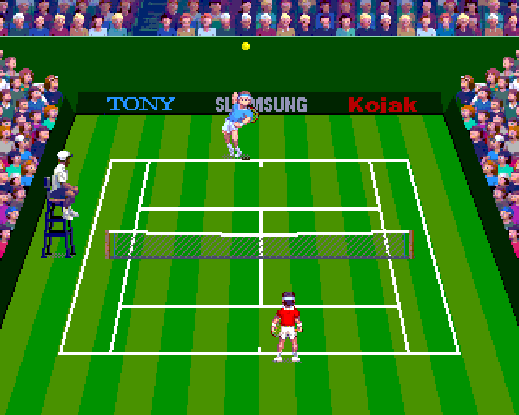
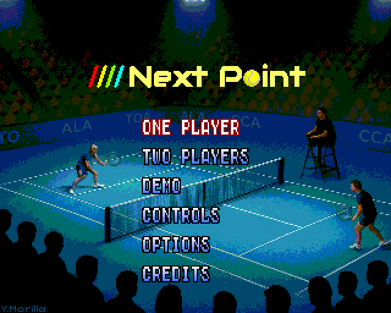
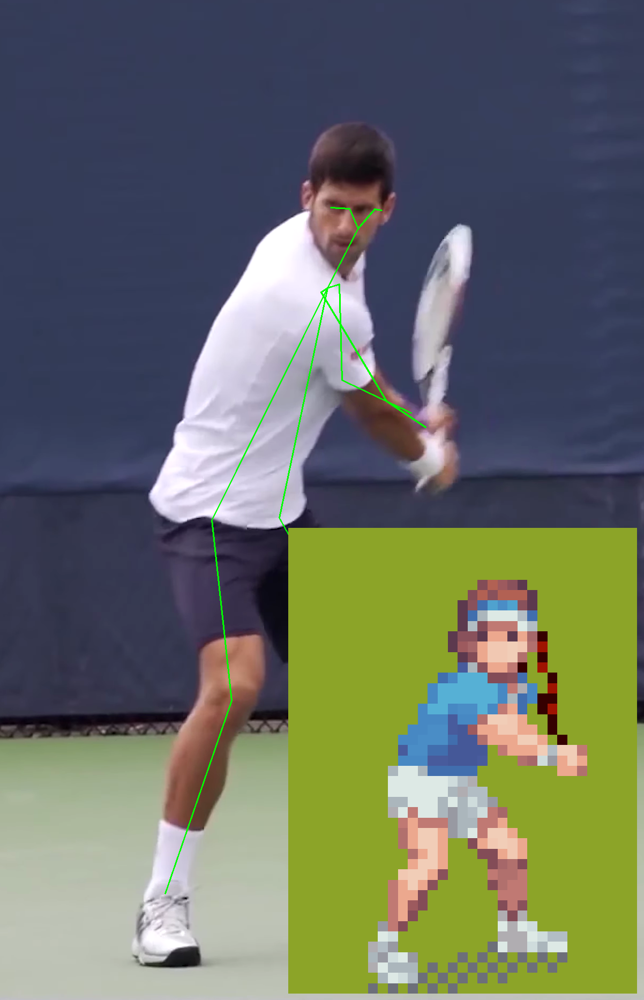
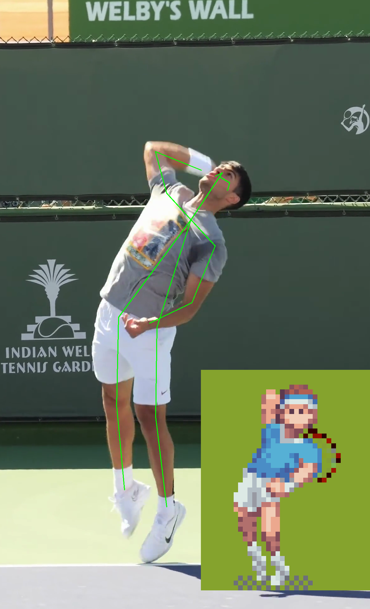

# Next Point

## Overview

*Next Point* is a tennis video game developed exclusively for the *ZX Spectrum Next*, paying homage to the classic sports titles of the golden era of ZX Spectrum. The game takes full advantage of the Next's hardware, featuring digitized sounds, large sprites, colourful backgrounds, and intensive use of memory banks.

  
  
  

 

## Do you like it? [Vote](https://www.specnext.com/white-next-contest/) for me, please!

Development of Next Point started as an idea to participate in the [White Next](https://www.specnext.com/contest-time/) contest. You can show your support [VOTING](https://www.specnext.com/white-next-contest/) for it here (until the 29th of May). In its current state, the game showcases the core gameplay mechanics and features. The final release will include a total of 12 distinct opponents, each with unique sprites and court strategies, along with additional animations, sounds, intro music and refined playability.
## Download and play

[Download here](releases/next-point-1.0.1.nex) the latest release and transfer it to the SD Card of your Next or N-GO. Otherwise, it works pretty decently with [CSpect](https://mdf200.itch.io/cspect), the Next emulator by Mike Dailly.

Next Point aims to bring a fast-paced, fun tennis simulation to the Next, with a focus on playability. Controls are intuitive: move around the court using the joystick or customized keys, and hit the ball with the fire button. The game intelligently selects the appropriate short — drive, backhand or smash.

Players can perform serves, volleys, smashes, lobs, and other tennis moves. Ball physics and pacing are tuned to deliver exciting rallies without overwhelming complexity. If the action feels too fast, you can adjust the speed in the options menu. 

## Design and tools 
*Next Point* is developed in *C* and *Assembler* to maximize the capabilities of the Next Hardware. Several custom tools and scripts were created in the process to streamline graphics production and sound preparation. Player animations are based on motion captures of real players, enhanced with AI-based landmark detection.

  
  

 
Next Point has been developed with the following tools:

- *Z88DK* as the main development environment
- *Aseprite* with AI support (*PixelLab plugin*) for sprites and graphic design
- *CSpect* + *DeZog* for simulation and debugging 
- *Audacity* for the preparation of sound samples
- *Arkos Tracker* for the upcoming soundtrack (work in progress)

## Credits
Special thanks to my son *David*, who provided the umpire's voice; to my son Diego, who contributed ideas and some in-game player sounds; and to my wife, whose input helped shape the music and the upcoming sounds for female players.

This game would not have been possible without the great tools used in its development. I’d especially like to thank:
- *DOM* for his great work on [z88dk](https://github.com/z88dk/z88dk/wiki) and his prompt support on the forums — along with all contributors to this excellent project.
- [Maziac](https://github.com/maziac) for his fantastic [DeZog](https://github.com/maziac/DeZog) debugger, which now supports some basic debugging capabilities of [C programs](https://github.com/maziac/DeZog/releases/tag/v3.6.0), to which I have proudly contributed.
- Tomaˇz Kragelj for his [ZX Spectrum Next Assembly Developer Guide](https://github.com/tomaz/zx-next-dev-guide), the most comprehensive resource for Next developers.
- Mike Dailly for [CSpect](https://mdf200.itch.io/cspect), the emulator used throughout the whole development process.
- Damien Guard for his fantastic [fonts](https://damieng.com/typography/) which were used in the making of this game.

This game is dedicated to the *memory of my father* who bought my first computer — a Sinclair ZX81 — and passed on to me his passion for technology and computers.

## Known issues
- Tie breaks are not yet implemented
- Only one opponent implemented... these pretty sprites don't come for free ;)

## Author
Created by Victor Morilla and licensed under the terms of the [GNU General Public License v3.0 (GPL-3.0)](LICENSE).