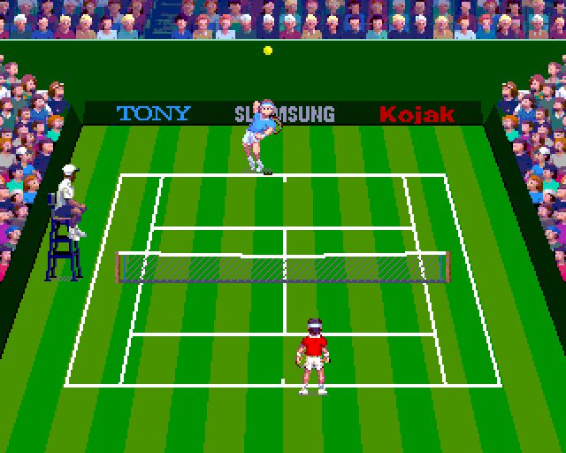
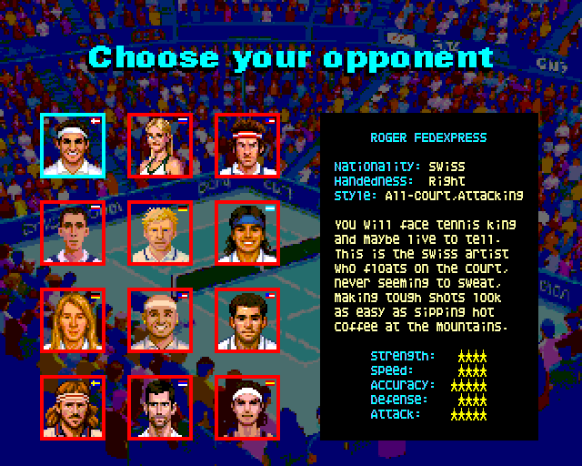
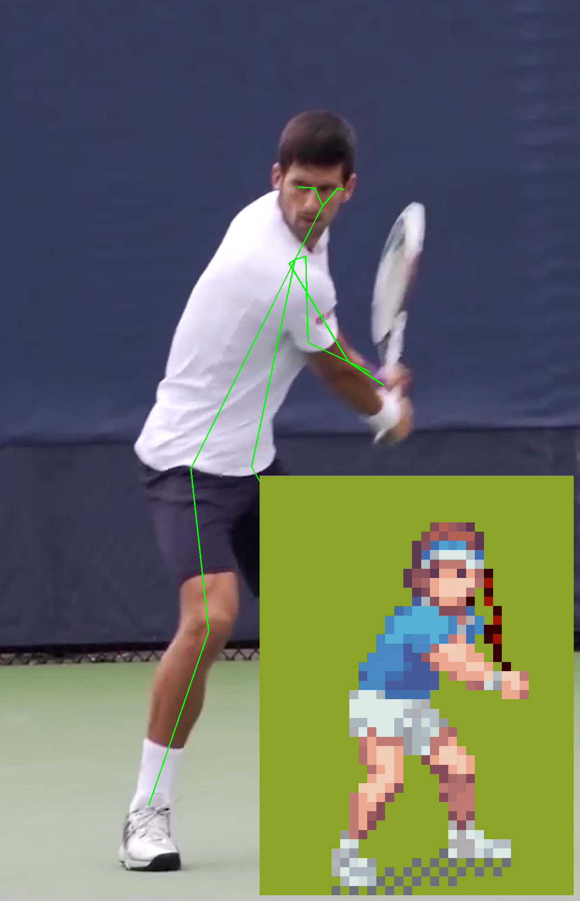

# Next Point

*Next Point* is a tennis video game developed exclusively for the *ZX Spectrum Next*, paying homage to the classic sports titles of the golden era of ZX Spectrum. The game takes full advantage of the Next's hardware, featuring digitized sounds, large sprites, colourful backgrounds, and intensive use of memory banks.

  
  

 

Development of Next Point started as an idea to participate in the [White Next](https://www.specnext.com/contest-time/) contest. In its current state, the game showcases the core gameplay mechanics and features. The final release will include a total of 12 distinct opponents, each with unique sprites and court strategies, along with additional animations, sounds, intro music and refined playability.

## Design and tools 
*Next Point* is developed in *C* and *Assembler* to maximize the capabilities of the Next hardware. Several custom tools and scripts were created in the process to streamline graphics production and sound preparation. Player animations are based on motion captures of real players, enhanced with AI-based landmark detection.

  
  

 

Next Point has been developed with the following tools:
- *Z88DK* as the main development environment
- *Aseprite* with AI support (*PixelLab plugin*) for sprites and graphic design
- *CSpect* + *DeZog* for simulation and debugging 
- *Audacity* for the preparation of sound samples
- *Arkos Tracker* for the upcoming soundtrack (work in progress)

More specifically, the game can be compiled with z88dk 2.3, but you will need to patch the floating point library (see [Fixes interrupt-induced race condition in math32 lib for sdcc](https://github.com/z88dk/z88dk/pull/2714)).

The logic of the game consists basically of three state machines:
- [The game state](../src/game_state.h), which drives the life cycle of the game: service, ball hit, ball bounced within valid area...
- [The player state](../src/player.h): taking care of the animations of the players (moving, hitting the ball, serving...) and triggering events like hitting the ball
- [The computer opponent state](../src/computer_controls.h), which controls how the computer controlled player acts.

The [game loop](../src/game_loop.h) orchestrates the sequencing of the game and updates the "next iteration time delta": a multiplying factor applied to calculate all movements in each step, avoiding lags and keeping the speed of the game consistent for 50Hz and 60Hz refresh rates.

The digitized sounds are 16kHz samples using two different channels: one mainly for effects, like the sound of the ball, and another one for umpire calls. A CTC controlled interruption takes care of playing the sounds (if any) as requested through the functions ["play_sound"](../src/sound.h) or "play_sound_channel_b". Sounds can expand to multiple memory banks but should be contiguous ones. The [dry sounds](../assets/dry-sounds/) are pre-processed with audacity to apply reverb and volume normalization effects and finally converted into the raw format loaded in memory.

Sprites are loaded dynamically, since the size and variety of positions of the player is far bigger the sprite patterns memory. It is also interesting to note that the net and the umpire are sprites; this way it is easy to accomplish the effect of the net appearing on top of the player at the upper side of the court and behind the player at the bottom.

All graphics (sprites, fonts and backgrounds) are designed with [Aseprite](https://www.aseprite.org/). The tool [ase2next](https://github.com/vmorilla/ase2next) is used to convert from aseprite format to files specfically formated for the game. Ase2next was specifically built during the development of Next Point, but I might come back to it to make it a bit more generic and reusable for other projects.

  
## Credits
Special thanks to my son *David*, who provided the umpire's voice; to my son Diego, who contributed ideas and some in-game player sounds; and to my wife, whose input helped shape the music and the upcoming sounds for female players.

This game would not have been possible without the great tools used in its development. I’d especially like to thank:
- *DOM* for his great work on [z88dk](https://github.com/z88dk/z88dk/wiki) and his prompt support on the forums — along with all contributors to this excellent project.
- [*Maziac*](https://github.com/maziac) for his fantastic [DeZog](https://github.com/maziac/DeZog) debugger, which now supports some basic debugging capabilities of [C programs](https://github.com/maziac/DeZog/releases/tag/v3.6.0), to which I have proudly contributed.
- *Tomaˇz Kragelj* for his [ZX Spectrum Next Assembly Developer Guide](https://github.com/tomaz/zx-next-dev-guide), the most comprehensive resource for Next developers.
- *Mike Dailly* for [CSpect](https://mdf200.itch.io/cspect), the emulator used throughout the whole development process.

 

This game is dedicated to the *memory of my father* who bought my first computer — a Sinclair ZX81 — and passed on to me his passion for technology and computers.

 
 

[2025 Víctor Morilla](https://github.com/vmorilla)

